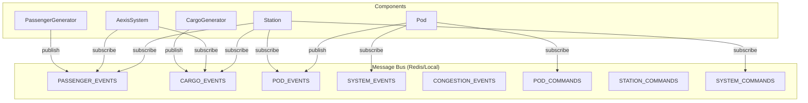
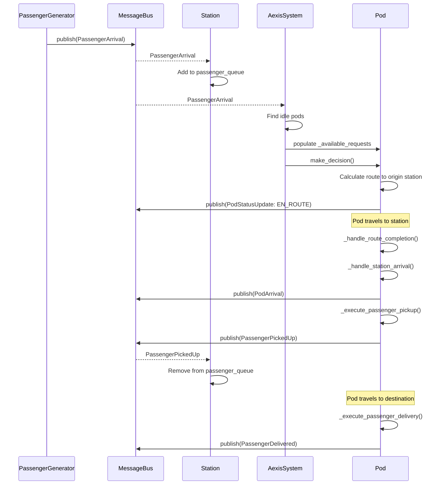
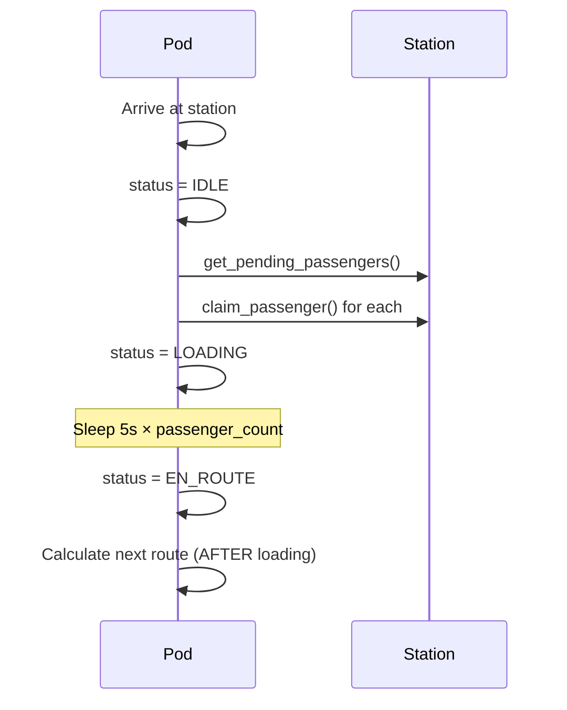

# AEXIS System Behaviour Documentation

This document describes the behavioral contracts, event flows, and component interactions in the AEXIS transportation system. It serves as the definitive reference for understanding when/where events propagate and how components respond.

---

## 1. Architecture Overview



---

## 2. Channel Definitions

| Channel Name        | Purpose               | Key Event Types                                         |
| ------------------- | --------------------- | ------------------------------------------------------- |
| `PASSENGER_EVENTS`  | Passenger lifecycle   | PassengerArrival, PassengerPickedUp, PassengerDelivered |
| `CARGO_EVENTS`      | Cargo lifecycle       | CargoRequest, CargoLoaded, CargoDelivered               |
| `POD_EVENTS`        | Pod state changes     | PodStatusUpdate, PodDecision, PodArrival, PodDeparture  |
| `SYSTEM_EVENTS`     | System-wide broadcast | SystemSnapshot, emergency alerts                        |
| `CONGESTION_EVENTS` | Traffic management    | CongestionAlert                                         |
| `POD_COMMANDS`      | Commands to pods      | AssignRoute                                             |
| `STATION_COMMANDS`  | Commands to stations  | UpdateCapacity                                          |
| `SYSTEM_COMMANDS`   | System commands       | Shutdown, config reload                                 |

---

## 3. Component Subscription Matrix

| Component       | PASSENGER_EVENTS             | CARGO_EVENTS             | POD_EVENTS             | SYSTEM_EVENTS             | POD_COMMANDS         | SYSTEM_COMMANDS             |
| --------------- | ---------------------------- | ------------------------ | ---------------------- | ------------------------- | -------------------- | --------------------------- |
| **AexisSystem** | ✅ `_handle_event`           | ✅ `_handle_event`       | ❌                     | ❌                        | ❌                   | ❌                          |
| **Station**     | ✅ `_handle_passenger_event` | ✅ `_handle_cargo_event` | ✅ `_handle_pod_event` | ❌                        | ❌                   | ✅ `_handle_system_command` |
| **Pod**         | ❌                           | ❌                       | ❌                     | ✅ `_handle_system_event` | ✅ `_handle_command` | ❌                          |

---

## 4. Event Flow: Passenger Lifecycle

### 4.1 Expected Flow (Design Intent)



### 4.2 Current Implementation Issues ⚠️

#### Issue 1: Pickup Logic Depends on Stale `_available_requests`

**Location:** [PassengerPod.\_execute_passenger_pickup](file:///home/godelhaze/dev/megalith/aexis/aexis/core/pod.py#L686-L736)

**Problem:** The pickup method filters `_available_requests` for passengers at the current station. However, `_available_requests` is populated **before** the pod starts moving, not when it arrives. If new passengers arrive while the pod is en-route, they are **not** included.

```python
# Current behavior (pod.py:699)
pickups = [r for r in self._available_requests if r.get("origin") == station_id and r.get("type") == "passenger"]
```

**Expected:** Pod should query the Station's live `passenger_queue` upon arrival.

---

#### Issue 2: Synchronous Event Publish in Station Arrival

**Location:** [PassengerPod.\_handle_station_arrival](file:///home/godelhaze/dev/megalith/aexis/aexis/core/pod.py#L677-L684)

**Problem:** Line 683 uses `publish_event` without `await`:

```python
self.message_bus.publish_event(MessageBus.get_event_channel(event.event_type), event)
```

In LocalMessageBus, this is an async method. Omitting `await` means the event may not propagate before pickup logic runs.

---

#### Issue 3: Subscription Order Race Condition

**Location:** [AexisSystem.start](file:///home/godelhaze/dev/megalith/aexis/aexis/core/system.py#L401-L461)

**Problem:** In `start()`, stations and pods call `start()` (which sets up subscriptions) **before** `AexisSystem._setup_subscriptions()` is called. This is correct for production, but the test file manually orders these differently.

```python
# In start():
for station in self.stations.values():
    station_tasks.append(asyncio.create_task(station.start()))
...
await self._setup_subscriptions()  # System subscribes AFTER components
```

**In test file (lines 73-83):**

```python
for station in aexis_system.stations.values():
    await station.start()
...
await aexis_system._setup_subscriptions()  # Matches production
```

This is actually correct, but the comment in the test is misleading.

---

#### Issue 4: Station Does Not Track Which Passengers Are Assigned

**Problem:** When multiple idle pods receive a `PassengerArrival` event, **all** of them may attempt to pick up the **same** passenger. There's no central coordination to mark a passenger as "claimed."

**Current Mitigation:** None. The first pod to arrive and call `_execute_passenger_pickup` will pick them up, but other pods may have already routed to the same station.

---

#### Issue 5: Pod Does Not Re-Query on Arrival

**Location:** [PassengerPod.\_execute_passenger_pickup](file:///home/godelhaze/dev/megalith/aexis/aexis/core/pod.py#L686-L736)

**Problem:** Pod picks up from `_available_requests` which was populated at decision time. It does not:

1. Verify the passenger is still waiting
2. Query the Station for current queue state
3. Handle the case where passenger was picked up by another pod

---

## 5. Event Flow: Cargo Lifecycle

Similar to passenger flow, with these event types:

- `CargoRequest` → Station adds to `cargo_queue`
- `CargoLoaded` → Station removes from `cargo_queue`
- `CargoDelivered` → Delivery confirmation

Same issues apply regarding `_available_requests` staleness.

---

## 6. Decision-Making Flow

### 6.1 Reactive Decision Trigger

When `PassengerArrival` or `CargoRequest` is published:

```mermaid
flowchart LR
    E[Event Published] --> SYS[AexisSystem._handle_event]
    SYS --> FIND[Find idle pods]
    FIND --> LOCAL[Prioritize pods at origin station]
    LOCAL --> POP[_populate_pod_requests]
    POP --> SEED[Seed event into _available_requests]
    SEED --> DECIDE[pod.make_decision]
    DECIDE --> ROUTE[RoutingProvider.get_decision]
    ROUTE --> EXEC[_execute_decision]
```



### 6.2 Decision Context Building

Each pod type builds context differently:

- **PassengerPod:** Includes `current_passengers`, `capacity`, `passenger_requests`
- **CargoPod:** Includes `current_cargo`, `weight_limit`, `cargo_requests`

---

## 7. Physical Movement Model

### 7.1 Update Loop

```python
# Pod.update(dt)
while dist_to_travel > 0:
    if not current_segment:
        await _handle_route_completion()
        return

    remaining = segment_length - segment_progress
    if dist_to_travel >= remaining:
        # Complete segment, advance to next
        _advance_segment()
    else:
        # Partial movement within segment
        segment_progress += dist_to_travel
```

### 7.2 Route Completion

When `segment_queue` is exhausted:

1. Snap to final station coordinate
2. Call `_handle_station_arrival(final_station)`
3. Set status to `IDLE`
4. Clear `current_route`

---

## 8. Implementation Status

| Item                      | Status             | Notes                                              |
| ------------------------- | ------------------ | -------------------------------------------------- |
| Passenger claim mechanism | ✅ Implemented     | `Station.claim_passenger()` prevents double-pickup |
| Live queue query          | ✅ Implemented     | `Station.get_pending_passengers()` used on arrival |
| Await on publish          | ✅ Fixed           | `_handle_station_arrival` correctly awaits         |
| Station query API         | ✅ Implemented     | `get_pending_passengers()`, `get_pending_cargo()`  |
| Pod-to-pod awareness      | ❌ Not implemented | Pods operate independently                         |

---

## 9. Edge Cases & Timing Behaviors

### 9.1 Loading/Unloading Timing



**Key behaviors:**

- Route calculation happens **after** loading to build correct context
- Loading time: `5 seconds × payload_count`
- FIFO pickup order (no priority handling)

### 9.2 Intermediate Station Behavior

Pods should pick up/drop off at **every station along their route**:

1. Arrive at station → Drop off payloads destined for this station
2. Check for pending passengers → Claim and load if capacity available
3. Continue to next station in route

### 9.3 Multi-Pod Conflict Resolution

**Scenario:** Two pods route to same passenger

| Event                         | Pod A               | Pod B                         |
| ----------------------------- | ------------------- | ----------------------------- |
| Both receive PassengerArrival | Routes to station   | Routes to station             |
| Pod A arrives first           | Claims passenger ✅ | Still en-route                |
| Pod B arrives                 | -                   | Claim fails → IDLE            |
| Pod B behavior                | -                   | Waits at station indefinitely |

**Recovery:** Pod B remains IDLE until a `CongestionAlert` from another station triggers re-routing.

### 9.4 Failed Pickup Behavior

When pod arrives at station with no claimable payloads:

1. `_execute_passenger_pickup()` returns early
2. Pod status → `IDLE`
3. Pod **does not** make proactive re-decision
4. Waits for `CongestionAlert` event to trigger movement

---

## 10. Test Coverage

| Test File                        | Covers                                  |
| -------------------------------- | --------------------------------------- |
| `test_pod_routing_integrated.py` | End-to-end routing with LocalMessageBus |
| `test_integration_flow.py`       | Passenger lifecycle infrastructure      |
| `test_system_movement.py`        | Pod physics and movement                |
| `test_pod_movement.py`           | Movement overflow and events            |
| `test_behavior_edge_cases.py`    | Claim conflicts, timing (TODO)          |

---

## 11. Appendix: Event Type Definitions

See [model.py](file:///home/godelhaze/dev/megalith/aexis/aexis/core/model.py) for complete dataclass definitions.

| Event                | Key Fields                                                          |
| -------------------- | ------------------------------------------------------------------- |
| `PassengerArrival`   | passenger_id, station_id, destination, priority                     |
| `PassengerPickedUp`  | passenger_id, pod_id, station_id, pickup_time                       |
| `PassengerDelivered` | passenger_id, pod_id, station_id, delivery_time, satisfaction_score |
| `CargoRequest`       | request_id, origin, destination, weight, deadline                   |
| `CargoLoaded`        | request_id, pod_id, station_id                                      |
| `CargoDelivered`     | request_id, pod_id, station_id, on_time                             |
| `PodStatusUpdate`    | pod_id, status, location, capacity_used                             |
| `CongestionAlert`    | station_id, congestion_level, queue_length                          |
