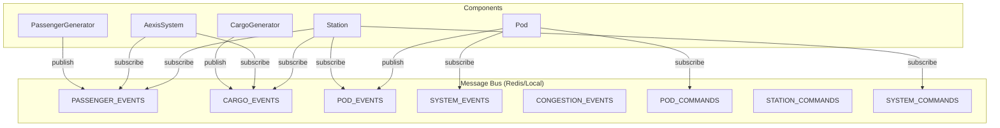
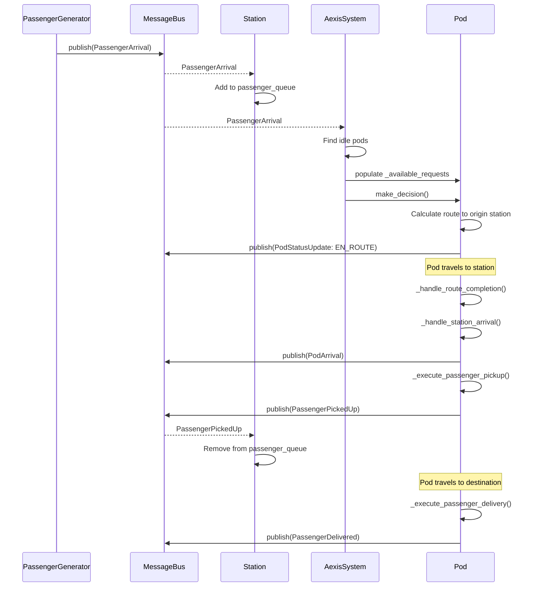

# AEXIS System Behaviour Documentation

This document describes the behavioral contracts, event flows, and component interactions in the AEXIS transportation system. It serves as the definitive reference for understanding when/where events propagate and how components respond.

---

## 1. Architecture Overview



---

## 2. Channel Definitions

| Channel Name | Purpose | Key Event Types |
|-------------|---------|-----------------|
| `PASSENGER_EVENTS` | Passenger lifecycle | PassengerArrival, PassengerPickedUp, PassengerDelivered |
| `CARGO_EVENTS` | Cargo lifecycle | CargoRequest, CargoLoaded, CargoDelivered |
| `POD_EVENTS` | Pod state changes | PodStatusUpdate, PodDecision, PodArrival, PodDeparture |
| `SYSTEM_EVENTS` | System-wide broadcast | SystemSnapshot, emergency alerts |
| `CONGESTION_EVENTS` | Traffic management | CongestionAlert |
| `POD_COMMANDS` | Commands to pods | AssignRoute |
| `STATION_COMMANDS` | Commands to stations | UpdateCapacity |
| `SYSTEM_COMMANDS` | System commands | Shutdown, config reload |

---

## 3. Component Subscription Matrix

| Component | PASSENGER_EVENTS | CARGO_EVENTS | POD_EVENTS | SYSTEM_EVENTS | POD_COMMANDS | SYSTEM_COMMANDS |
|-----------|------------------|--------------|------------|---------------|--------------|-----------------|
| **AexisSystem** | ✅ `_handle_event` | ✅ `_handle_event` | ❌ | ❌ | ❌ | ❌ |
| **Station** | ✅ `_handle_passenger_event` | ✅ `_handle_cargo_event` | ✅ `_handle_pod_event` | ❌ | ❌ | ✅ `_handle_system_command` |
| **Pod** | ❌ | ❌ | ❌ | ✅ `_handle_system_event` | ✅ `_handle_command` | ❌ |

---

## 4. Event Flow: Passenger Lifecycle

### 4.1 Expected Flow (Design Intent)



### 4.2 Current Implementation Issues ⚠️

#### Issue 1: Pickup Logic Depends on Stale `_available_requests`

**Location:** [PassengerPod._execute_passenger_pickup](file:///home/godelhaze/dev/megalith/aexis/aexis/core/pod.py#L686-L736)

**Problem:** The pickup method filters `_available_requests` for passengers at the current station. However, `_available_requests` is populated **before** the pod starts moving, not when it arrives. If new passengers arrive while the pod is en-route, they are **not** included.

```python
# Current behavior (pod.py:699)
pickups = [r for r in self._available_requests if r.get("origin") == station_id and r.get("type") == "passenger"]
```

**Expected:** Pod should query the Station's live `passenger_queue` upon arrival.

---

#### Issue 2: Synchronous Event Publish in Station Arrival

**Location:** [PassengerPod._handle_station_arrival](file:///home/godelhaze/dev/megalith/aexis/aexis/core/pod.py#L677-L684)

**Problem:** Line 683 uses `publish_event` without `await`:

```python
self.message_bus.publish_event(MessageBus.get_event_channel(event.event_type), event)
```

In LocalMessageBus, this is an async method. Omitting `await` means the event may not propagate before pickup logic runs.

---

#### Issue 3: Subscription Order Race Condition

**Location:** [AexisSystem.start](file:///home/godelhaze/dev/megalith/aexis/aexis/core/system.py#L401-L461)

**Problem:** In `start()`, stations and pods call `start()` (which sets up subscriptions) **before** `AexisSystem._setup_subscriptions()` is called. This is correct for production, but the test file manually orders these differently.

```python
# In start():
for station in self.stations.values():
    station_tasks.append(asyncio.create_task(station.start()))
...
await self._setup_subscriptions()  # System subscribes AFTER components
```

**In test file (lines 73-83):**
```python
for station in aexis_system.stations.values():
    await station.start()
...
await aexis_system._setup_subscriptions()  # Matches production
```

This is actually correct, but the comment in the test is misleading.

---

#### Issue 4: Station Does Not Track Which Passengers Are Assigned

**Problem:** When multiple idle pods receive a `PassengerArrival` event, **all** of them may attempt to pick up the **same** passenger. There's no central coordination to mark a passenger as "claimed."

**Current Mitigation:** None. The first pod to arrive and call `_execute_passenger_pickup` will pick them up, but other pods may have already routed to the same station.

---

#### Issue 5: Pod Does Not Re-Query on Arrival

**Location:** [PassengerPod._execute_passenger_pickup](file:///home/godelhaze/dev/megalith/aexis/aexis/core/pod.py#L686-L736)

**Problem:** Pod picks up from `_available_requests` which was populated at decision time. It does not:
1. Verify the passenger is still waiting
2. Query the Station for current queue state
3. Handle the case where passenger was picked up by another pod

---

## 5. Event Flow: Cargo Lifecycle

Similar to passenger flow, with these event types:
- `CargoRequest` → Station adds to `cargo_queue`
- `CargoLoaded` → Station removes from `cargo_queue`
- `CargoDelivered` → Delivery confirmation

Same issues apply regarding `_available_requests` staleness.

---

## 6. Decision-Making Flow

### 6.1 Reactive Decision Trigger

When `PassengerArrival` or `CargoRequest` is published:

```mermaid
flowchart LR
    E[Event Published] --> SYS[AexisSystem._handle_event]
    SYS --> FIND[Find idle pods]
    FIND --> LOCAL[Prioritize pods at origin station]
    LOCAL --> POP[_populate_pod_requests]
    POP --> SEED[Seed event into _available_requests]
    SEED --> DECIDE[pod.make_decision]
    DECIDE --> ROUTE[RoutingProvider.get_decision]
    ROUTE --> EXEC[_execute_decision]
```



### 6.2 Decision Context Building

Each pod type builds context differently:
- **PassengerPod:** Includes `current_passengers`, `capacity`, `passenger_requests`
- **CargoPod:** Includes `current_cargo`, `weight_limit`, `cargo_requests`

---

## 7. Physical Movement Model

### 7.1 Update Loop

```python
# Pod.update(dt)
while dist_to_travel > 0:
    if not current_segment:
        await _handle_route_completion()
        return
    
    remaining = segment_length - segment_progress
    if dist_to_travel >= remaining:
        # Complete segment, advance to next
        _advance_segment()
    else:
        # Partial movement within segment
        segment_progress += dist_to_travel
```

### 7.2 Route Completion

When `segment_queue` is exhausted:
1. Snap to final station coordinate
2. Call `_handle_station_arrival(final_station)`
3. Set status to `IDLE`
4. Clear `current_route`

---

## 8. Missing Behaviors & Gaps

| Gap | Description | Impact | Priority |
|-----|-------------|--------|----------|
| **No passenger claim mechanism** | Multiple pods can route to same passenger | Wasted routes, inefficiency | High |
| **Stale request list** | `_available_requests` not refreshed on arrival | Missed pickups, empty trips | High |
| **Sync publish bug** | Missing `await` on PodArrival publish | Race condition in event handling | Medium |
| **No station query API** | Pod cannot ask Station for current queue | Forces reliance on pre-populated data | Medium |
| **No pod-to-pod awareness** | Pods don't know other pods' routes | Duplicate route decisions | Low |

---

## 9. Recommended Fixes

### 9.1 Add Station Query for Live Queue

```python
# In Station
def get_pending_passengers(self, for_destination: str = None) -> list[dict]:
    """Return passengers still waiting for pickup"""
    if for_destination:
        return [p for p in self.passenger_queue if p["destination"] == for_destination]
    return list(self.passenger_queue)
```

### 9.2 Fix Missing Await

```python
# In PassengerPod._handle_station_arrival
await self.message_bus.publish_event(...)  # Add await
```

### 9.3 Add Passenger Claim System

```python
# In Station
async def claim_passenger(self, passenger_id: str, pod_id: str) -> bool:
    """Atomically claim a passenger for a pod. Returns False if already claimed."""
    for p in self.passenger_queue:
        if p["passenger_id"] == passenger_id:
            if p.get("claimed_by"):
                return False
            p["claimed_by"] = pod_id
            return True
    return False
```

### 9.4 On-Arrival Queue Refresh

```python
# In PassengerPod._execute_passenger_pickup
async def _execute_passenger_pickup(self, station_id: str):
    # Query station for current queue instead of using stale _available_requests
    station = ... # Get station reference
    pending = station.get_pending_passengers()
    pickups = [p for p in pending if self._can_pickup(p)]
```

---

## 10. Test Coverage Analysis

| Test File | Covers |
|-----------|--------|
| `test_pod_routing_integrated.py` | End-to-end routing with LocalMessageBus |
| `test_comprehensive.py` | Unit tests for core components |
| `test_critical_features.py` | Feature-specific integration |
| `test_system_movement.py` | Pod physics and movement |

**Gap:** No test for passenger claim conflicts or stale request scenarios.

---

## 11. Appendix: Event Type Definitions

See [model.py](file:///home/godelhaze/dev/megalith/aexis/aexis/core/model.py) for complete dataclass definitions.

| Event | Key Fields |
|-------|-----------|
| `PassengerArrival` | passenger_id, station_id, destination, priority |
| `PassengerPickedUp` | passenger_id, pod_id, station_id, pickup_time |
| `PassengerDelivered` | passenger_id, pod_id, station_id, delivery_time, satisfaction_score |
| `CargoRequest` | request_id, origin, destination, weight, deadline |
| `CargoLoaded` | request_id, pod_id, station_id |
| `CargoDelivered` | request_id, pod_id, station_id, on_time |
| `PodStatusUpdate` | pod_id, status, location, capacity_used |
| `CongestionAlert` | station_id, congestion_level, queue_length |
